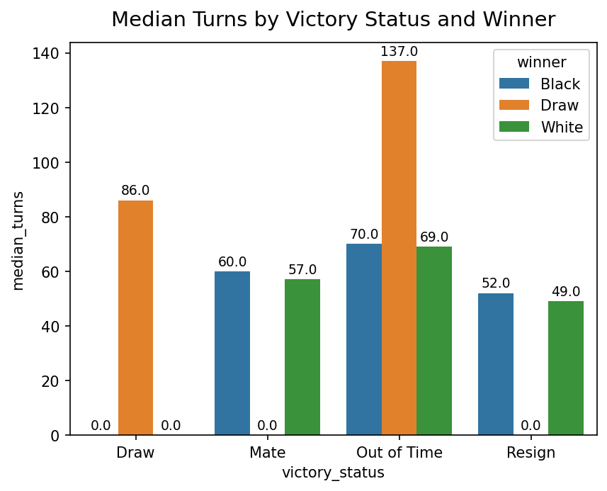
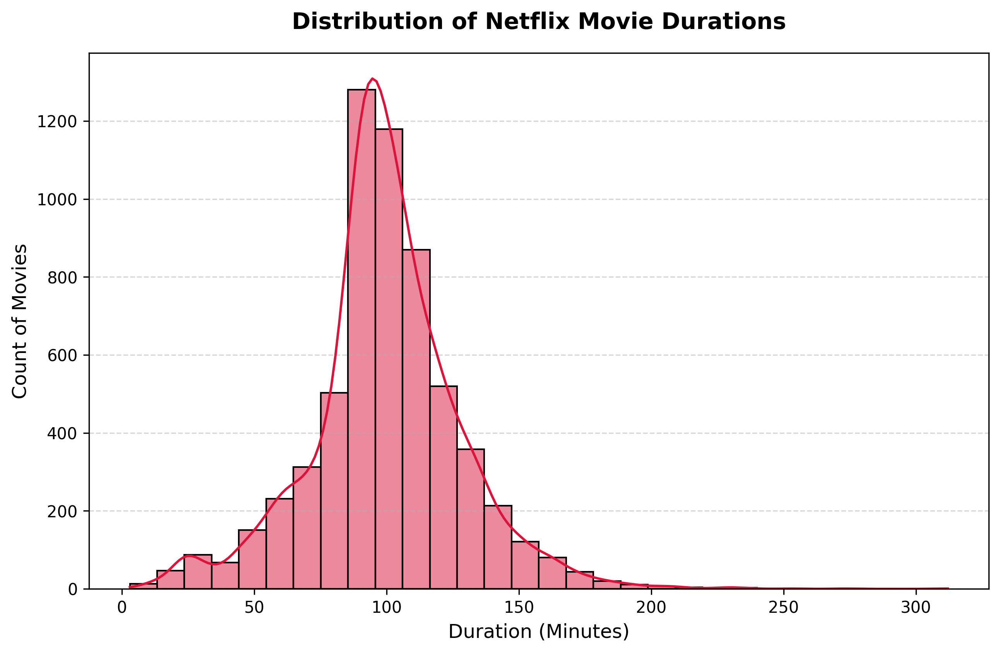
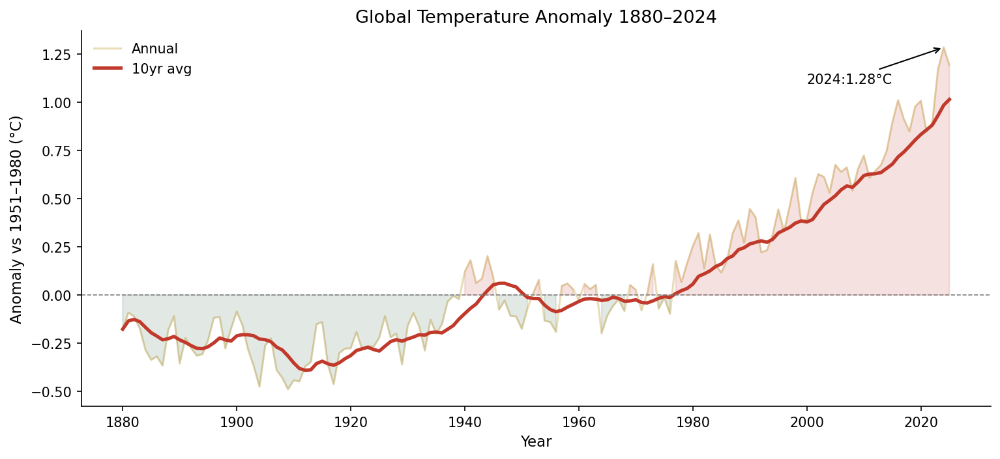

# Data Analysis Summary
## Executive Summary
This report shares the main facts from three different datasets. To give you the answers first:
*	**Chess:** Matches last much longer when players run out of time instead of checkmating or resigning.
*	**Netflix:** Most movies share a standard runtime of 90 to 100 minutes.
*	**Temperature:** Global temperatures have climbed steadily, hitting a record high in 2024.
---
## 1. Online Chess Matches
When checking how chess games end, the data shows that time tracking changes match lengths. Games that finish because a player runs out of time (**Out of Time**) have the highest move counts. When a game ends as a draw because someone ran out of time, the median length reaches a peak of 137 moves.
In contrast, when a game finishes through checkmate (**Mate**) or when a player gives up (**Resign**), matches are much shorter. These wrap up quickly, lasting only between 49 and 60 moves. This shows that players stretch matches out much longer when they are trapped in a hard game without a clear winner.

**Chart Citation:** This finding is from **`AQ1.png`**.
## 2. Netflix Movie Durations
When looking at movie lengths on Netflix, the data shows a clear pattern. Most films cluster tightly together around a single runtime. The highest bar on the chart shows that the most common movie length is between 90 and 100 minutes long.
This timeframe matches the standard movie lengths found in traditional cinemas. After this peak, the chart numbers drop off very quickly. While there are a few short videos or long movies that stretch past 150 minutes, they are rare exceptions. Netflix builds its catalog around this 90-to-100-minute sweet spot.

**Chart Citation:** This finding is from **`AQ4-a_netflix_movie_duration_histogram.png`**.
## 3. Global Temperature Anomalies
The weather data tracks how much global temperatures have shifted away from historical normal numbers between 1880 and 2024. Early on, the earth was cooler than the baseline average. However, starting around the late 1970s, global temperatures began to climb rapidly.
This warming trend reached its highest point at the very end of the chart, where the temperature anomaly hit a record high of +1.28°C in 2024. The smooth line confirms that this is a steady, long-term warming trend rather than just a few temporary hot years.

**Chart Citation:** This finding is from **`AQ3.png`**.

